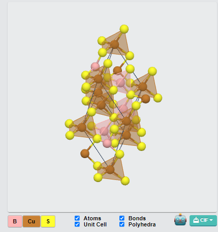
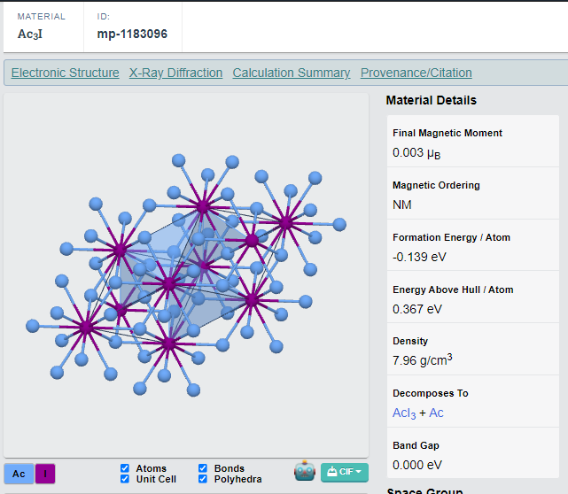
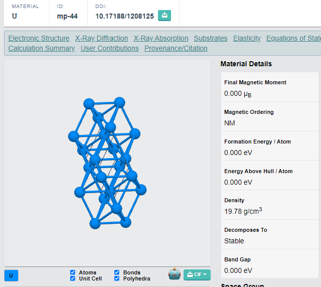
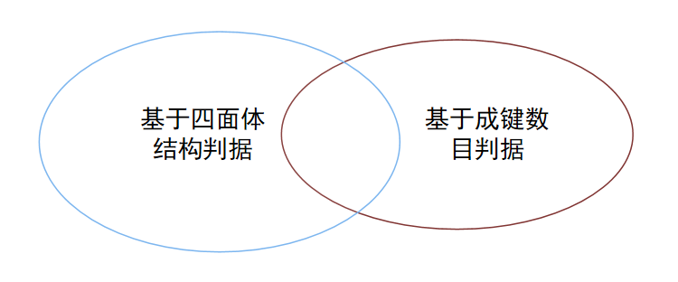

# 四面体筛选器

## 一、介绍

在使用[MP-downloader](https://github.com/GCaptainNemo/MP-downloader)从Materials Project下载所有数据之后，需要从中筛选出四面体晶体来构造四面体数据集。

<p align="center"></p>

<h6 align="center">图一、四面体晶体例子 CuBS2</h6>

## 二、四面体判据

### 2.1 基于四面体几何判据

先对晶胞进行3×3×3的扩胞处理，然后对中间的每一个原子取最近邻的4个原子(不考虑成键条件)。根据四面体的**几何关系**，键长大致一致，键角成109°进行判别。

该判据利用了正四面体的几何结构，比如金刚石满足严格的正四面体。但现实的四面体有很多属于非正四面体，因此涉及键角误差阈值设定和键长误差阈值设定，往往难以把握。

比如图一 CuBS2 就是极不对称的四面体，其中Cu的4个近邻S原子的夹角可以达到95°-120°，而S近邻的两个B原子和Cu原子之间的键长可达0.32埃。把阈值调的过大容易引入很多非四面体。


### 2.2 基于成键数目判据

考虑成键条件，先对晶胞进行3×3×3的扩胞处理，然后对中间的每一个原子计算成键原子，如果每个原子的**成键数目都是4**，则认为是四面体。

该判据成立的关键是找到准确的**成键判据**，这里参考pymatgen可视化模块[1]中的做法:

```
d(i, j) < (1 + poly_radii_tol_factor) * 离子半径之和
```

poly_radii_tol_factor取0.5即如果两个原子之间的距离小于1.5乘离子半径之和则认为成键。但该方法仍存在问题，比如图一中B原子在poly_radii_tol_factor取0.5的情况下是没有成键的，而增大到0.55可以成键。

基于成键数目的判断最主要的问题就是成键判据，以如下两种材料为例，阳离子配位数为6，但使用如上判据却只有四个原子成键，造成误判。

<p align="center"></p>

<h6 align="center">图二、筛选错误例子(左Ac3I，右U4)</h6>


### 2.3 画多面体算法(补充)

类似图一显示效果，具体画四面体算法流程[2]如下：

1. 把晶体中所有元素按电负性进行排序，其中阴离子(anion)是电负性最大的，令anion_radius = anion.average_ionic_radius。
2. 遍历所有原子，如果是阴离子则跳过(相当于剩下的是阳离子)。对原子取max_radius  = average_ionic_radius，然后令最大距离等于1.5 * (anion_radius + max_radius)。
3. 接着对在最大距离内的原子进行判断，若原子为阴离子则成键。
4. 画键(以阳离子为中心判断成键)、多面体(以阳离子为中心画多面体)。


### 2.4 基于化学环境的判断

ChemEnv软件包是用来分析晶体化学配位环境，并识别最接近当前配位环境的模型配位环境。也就是说该包首先**具有很多标准模型**，当分析一个新的CIF文件时，原子的位置充满噪声，ChemEnv会通过某些策略找到最接近标准模型的配位环境。


## 三、运行结果

### 3.1  方法2.1、2.2运行结果

```
python ./src/judge_tetrahedron.py
```


<p align="center"></p>


<h6 align="center">图三、筛选结果</h6>

从124657个Materials Project中分别按两种判据筛选，第一种筛出了1167个，第二种筛出了931个，两者交集共699个，并集共1399个。


### 3.2  方法2.4运行结果

```
python ./src/judge_tetrahedron_new.py
```


## 四、参考资料

[1] [pymatgen-MultiStructuresVis-poly_radii_tol_factor](https://pymatgen.org/pymatgen.vis.structure_vtk.html)

[2] [github-set_structure-show_polyhedron](https://github.com/materialsproject/pymatgen/blob/v2022.2.10/pymatgen/vis/structure_vtk.py#L943-L1204)

